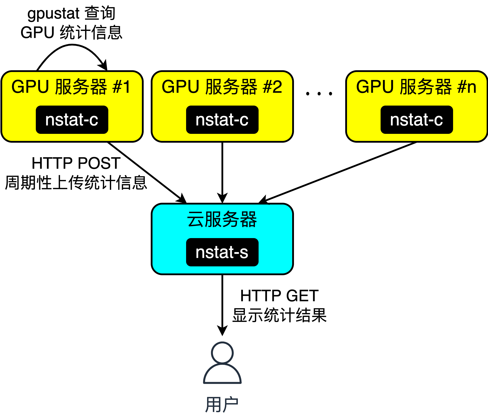

# nstat

## 原理



## 环境要求

- [gpustat](https://github.com/wookayin/gpustat): 查询显卡统计信息，客户端必选
- [json2html](https://github.com/softvar/json2html): 将 `.json` 数据转换为可视化 `.html` 文本，服务器端必选
- [pyinstaller](https://pyinstaller.org/): 将 `.py` 文件连同环境打包为可执行文件，可选
- [pyyaml](https://pyyaml.org/): 读取 `.yaml` 配置文件，必选
- [requests](https://requests.readthedocs.io/): 发送 HTTP 请求，客户端必选

所有这些 Python 第三方包都可以简单地使用 `pip` 进行安装：

```shell
$ pip install -r requirements.txt
```

## GPU 服务器端

```shell
$ python nstat-c.py nstat-c.yaml
```

其中 `nstat-c.yaml` 为配置文件，需要手动修改，详见模板 [nstat-c.yaml](./nstat-c.yaml)。

## 云服务器端

```shell
$ python nstat-s.py nstat-s.yaml
```

其中 `nstat-s.yaml` 为配置文件，正常情况下不需要手动修改，详见模板 [nstat-s.yaml](./nstat-s.yaml)。

## 构建

```shell
$ pyinstaller -F nstat-c.py
$ pyinstaller -F nstat-s.py
```
